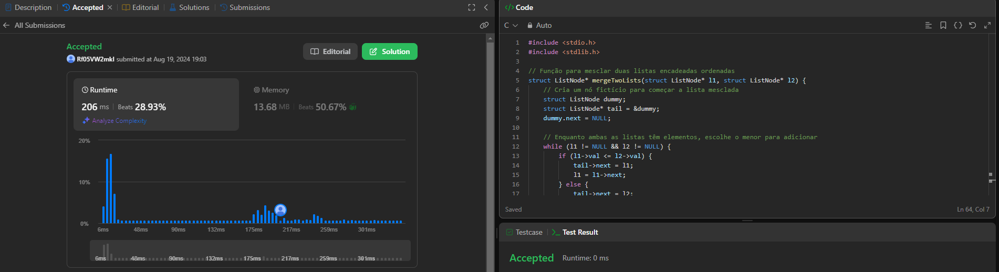
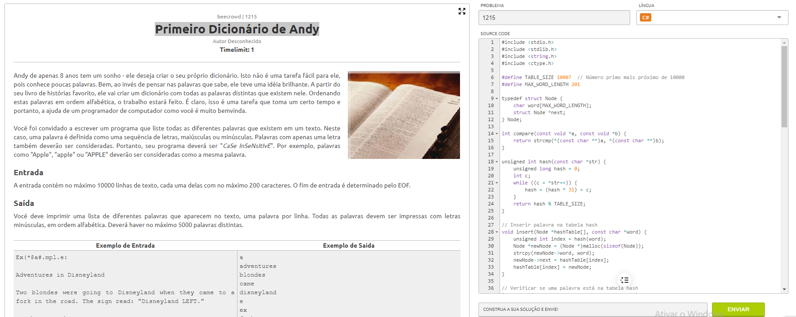

# Dividir-e-Conquistar-Judge-Online

## Alunos

| Matrícula  | Aluno          |
| ---------- | -------------- |
| 22/2037657 | Arthur Alves   |
| 21/1031495 | Samuel Ricardo |

## Visão Geral

| Problema      | Dificuldade | Link para o Problema | Solução                                                                                          |
|---------------|-------------|----------------------|--------------------------------------------------------------------------------------------------|
| Problema 1    | Difícil      | [Merge k Sorted Lists](https://leetcode.com/problems/merge-k-sorted-lists) | [Código](https://github.com/projeto-de-algoritmos-2024/Dividir-e-Conquistar-Judge-Online/blob/main/Merge%20k%20Sorted%20Lists/Merge-k-Sorted-Lists.c) |
| Problema 2    | Média        | [Primeiro Dicionário de Andy](https://judge.beecrowd.com/pt/problems/view/1215) | [Código](https://github.com/projeto-de-algoritmos-2024/Dividir-e-Conquistar-Judge-Online/blob/main/Primeiro%20Dicionario%20de%20Andy/Primeiro-Dicionario-de-Andy.c) |
| Problema 3    | Média        | [2 Keys Keyboard](https://leetcode.com/problems/2-keys-keyboard/description/) | [Código](https://github.com/projeto-de-algoritmos-2024/Dividir-e-Conquistar-Judge-Online/blob/main/2%20Keys%20Keyboard/2keys-keyboard.c) |
| Problema 4    | Difícil       | [Reverse Pairs](https://leetcode.com/problems/reverse-pairs) | [Código](https://github.com/projeto-de-algoritmos-2024/Dividir-e-Conquistar-Judge-Online/blob/main/Reverse%20Pairs/ReversePairs.c) |

### Problema 1

Dificuldade: Difícil

Link para o problema: [Merge k Sorted Lists](https://leetcode.com/problems/merge-k-sorted-lists)

Solução: [Código](https://github.com/projeto-de-algoritmos-2024/Dividir-e-Conquistar-Judge-Online/blob/main/Merge%20k%20Sorted%20Lists/Merge-k-Sorted-Lists.c)

### Problema 2

Dificuldade: Média

Link para o problema: [Primeiro Dicionário de Andy](https://judge.beecrowd.com/pt/problems/view/1215)

Solução: [Código](https://github.com/projeto-de-algoritmos-2024/Dividir-e-Conquistar-Judge-Online/blob/main/Primeiro%20Dicionario%20de%20Andy/Primeiro-Dicionario-de-Andy.c)

